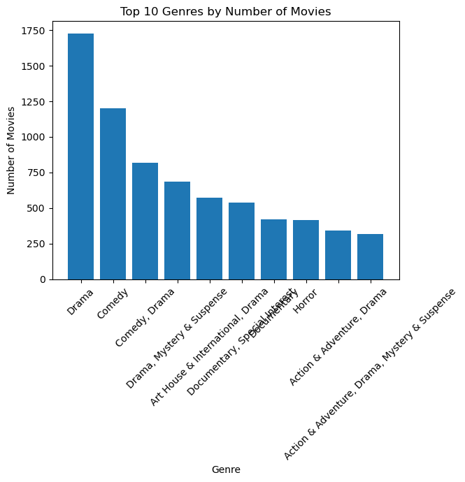
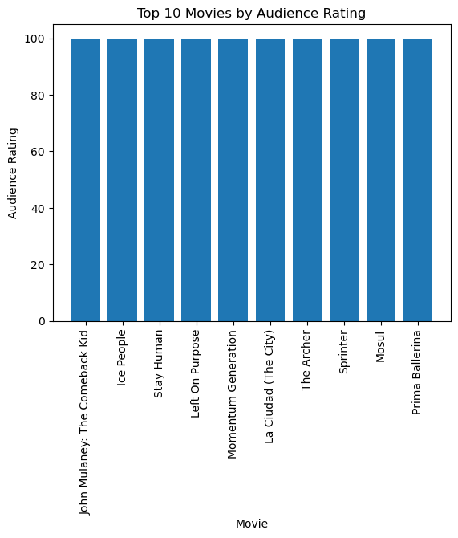
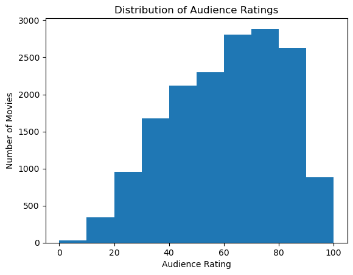
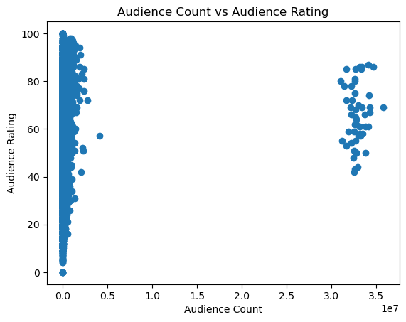

# Rotten Tomatoes Movie Analysis

## Project Overview

This project analyses Rotten Tomatoes movie data using Python, Pandas, and Matplotlib.

The purpose of this project is to perform data cleaning, exploratory data analysis (EDA), aggregation, and visualization to identify patterns and insights within movie data.

The analysis focuses on movie genres, audience ratings, audience counts, studios, directors, and movie rating categories.

---

## Objectives

The main objectives of this project are:

- Clean and prepare the movie dataset for analysis
- Identify and remove duplicate records
- Handle missing and inconsistent data
- Standardise text-based columns
- Convert numerical columns into appropriate data types
- Analyse movie genres
- Identify movies with the highest audience ratings
- Analyse the distribution of audience ratings
- Analyse audience count and audience ratings
- Analyse movie studios
- Analyse directors
- Compare audience ratings across movie rating categories
- Create visualizations to communicate the results

---

## Dataset

The dataset contains information about movies from Rotten Tomatoes.

The main columns used in the analysis include:

- `movie_title` — Movie title
- `genre` — Movie genre
- `rating` — Movie rating category
- `directors` — Movie director
- `studio_name` — Studio associated with the movie
- `audience_count` — Number of audience ratings
- `audience_rating` — Audience rating

---

## Tools and Technologies

The following tools and technologies were used:

- **Python**
- **Pandas**
- **Matplotlib**
- **Spyder**

---

## Data Cleaning

The dataset was cleaned and prepared before performing the analysis.

The main data cleaning steps included:

- Selecting the required columns
- Checking for duplicate records
- Removing duplicate records
- Checking for missing values
- Handling missing genre values
- Handling missing director values
- Handling missing studio values
- Cleaning genre information
- Cleaning director information
- Standardising movie titles
- Standardising studio names
- Converting audience count to numeric format
- Converting audience rating to numeric format
- Handling missing numerical values
- Cleaning movie rating categories

These steps helped prepare the dataset for further analysis and visualization.

---

## Exploratory Data Analysis

The project includes several exploratory analyses.

### Genre Analysis

The number of movies in different genres was analysed to identify the most common genres in the dataset.

### Audience Rating Analysis

Audience ratings were analysed to identify highly rated movies and understand the overall distribution of audience ratings.

### Studio Analysis

The number of movies associated with different studios was analysed to identify studios with the highest number of movies.

### Director Analysis

The number of movies associated with different directors was analysed to identify directors with the highest number of movies.

### Movie Rating Analysis

Average audience ratings were compared across different movie rating categories.

### Audience Count Analysis

Audience counts were analysed to understand the level of audience engagement with different movies.

### Audience Count vs Audience Rating

A scatter plot was created to examine the relationship between audience count and audience rating.

---

## Key Visualizations

### 1. Top 10 Genres by Number of Movies



This chart shows the top 10 genres based on the number of movies in the dataset.

---

### 2. Top 10 Movies by Audience Rating



This chart shows the movies with the highest audience ratings.

---

### 3. Audience Rating Distribution



This histogram shows the distribution of audience ratings across the movie dataset.

---

### 4. Audience Count vs Audience Rating



This scatter plot compares audience count with audience rating to explore the relationship between audience engagement and movie ratings.

---

## Analysis Performed

The project answers a range of analytical questions, including:

- How many movies are in the dataset?
- How many unique genres are present?
- Which genres contain the most movies?
- Which movies have the highest audience ratings?
- What is the average audience rating?
- What is the highest audience count?
- Which studios have the most movies?
- Which directors have the most movies?
- How many movies belong to each movie rating category?
- What is the average audience rating for each movie rating category?
- Which genres have the highest average audience rating?
- What is the relationship between audience count and audience rating?

---

## Python and Pandas Techniques

The project demonstrates practical use of Python and Pandas techniques, including:

- Reading CSV files
- DataFrame selection
- Duplicate detection
- `drop_duplicates()`
- Missing-value handling
- `fillna()`
- String cleaning
- `str.strip()`
- `str.title()`
- `str.upper()`
- `replace()`
- Numeric conversion using `pd.to_numeric()`
- `value_counts()`
- `groupby()`
- Aggregation
- `mean()`
- `count()`
- `sort_values()`
- `head()`
- Boolean filtering

---

## Data Visualization Techniques

Matplotlib was used to create different types of visualizations, including:

- Bar charts
- Histograms
- Scatter plots

These visualizations were used to identify patterns and communicate the results of the analysis.

---

## Project Structure

```text
rotten-tomatoes-analysis
│
├── README.md
├── rotten_tomatoes_analysis.py
├── top-genres-by-movie-count.png
├── top-movies-by-audience-rating.png
├── audience-rating-distribution.png
└── audience-count-vs-rating.png
